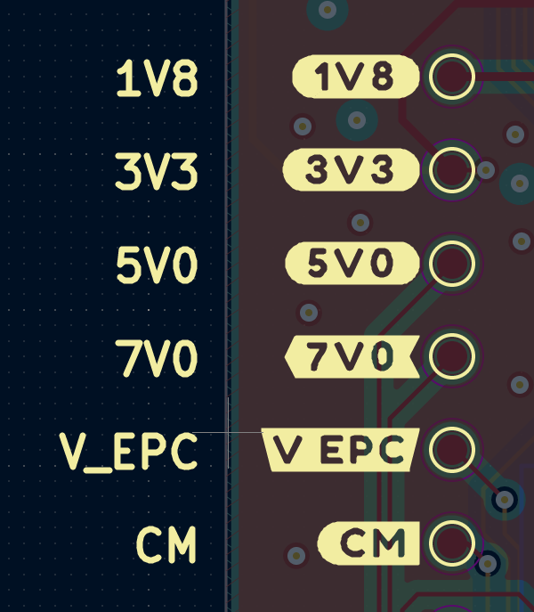

# Buzzard plugin for KiCad
    Supports 5.1.x and 5.99 KiCad Builds

Basic plugin wrapper for [Buzzard](https://github.com/sparkfunX/Buzzard). 

This plugin lets you easily create nice "Inverted" block text boxes.



## Installation

Before installing please have Python3 and pip3 installed.

KiCad's Pcbnew plugins can be placed in several places, depending on platform.

The following paths are recommended. You may need to create the scripting\plugins folder if it does not exist:

    Windows
        %APPDATA%\kicad\scripting\plugins
        (e.g. C:\Users\[USERNAME]\AppData\Roaming\kicad\scripting\plugins)

    Linux
        ~/.kicad/scripting/plugins or
        ~/.kicad_plugins

    MacOS
        ~/Library/Application Support/kicad/scripting/plugins or on newer versions
        ~/Library/Preferences/kicad/scripting/plugins

Install the script in your KiCad scripting directory
Ensure you also get the submodules with KiBuzzard

```console
$ cd ~/.kicad/scripting/plugins
$ git clone https://github.com/Chromico/KiBuzzard.git --recursive
$ pip3 install -r requirements.txt --user
```

#### Only for KiCad 5.99 Users

You may also need to install xclip, to handle clipboard operations. 
On Ubuntu:

```console
$ sudo apt install xclip
```

#### For KiCad 5.1.x Stable Users on Windows

To avoid running into some issues with python when you try to use the plugin in KiCad, uncomment line 3 in deps/buzzard/buzzard.py and add the path to the directory where your pip3 packages are installed. 


Note: This has only been tested on Windows 10.
# Usage

Since, KiCad stable version doesn't support system clipboard operations, the footprint is placed at (0, 0). Please navigate there and move the label to where you want to place it

Refer to [Buzzard](https://github.com/sparkfunX/Buzzard) docs for options

## Licence and credits

Plugin code licensed under MIT, see `LICENSE` for more info.

 - [Buzzard](https://github.com/sparkfunX/Buzzard) From SparkFun
 - KiCad Plugin/Dilog inspiration from [Interactive HTML BOM](https://github.com/openscopeproject/InteractiveHtmlBom/)
